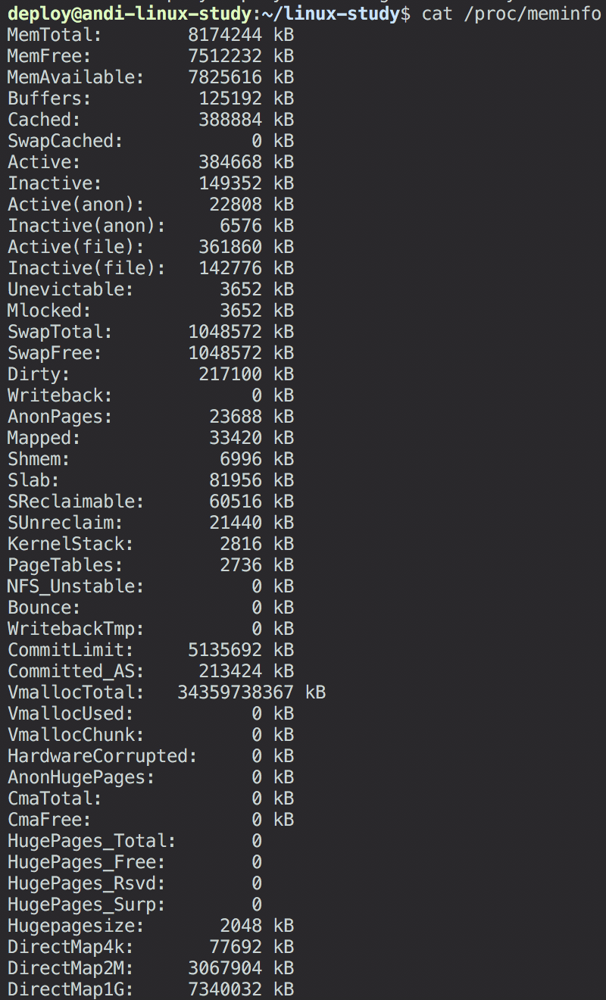
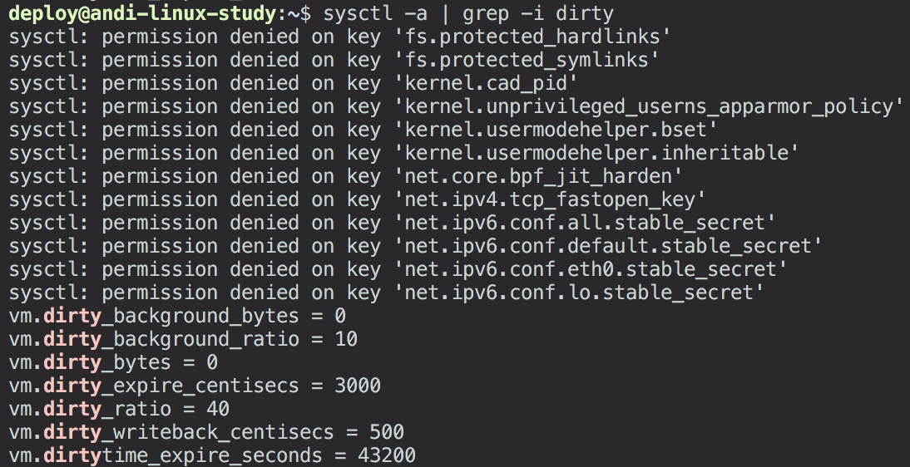
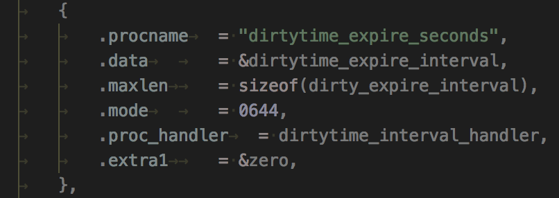
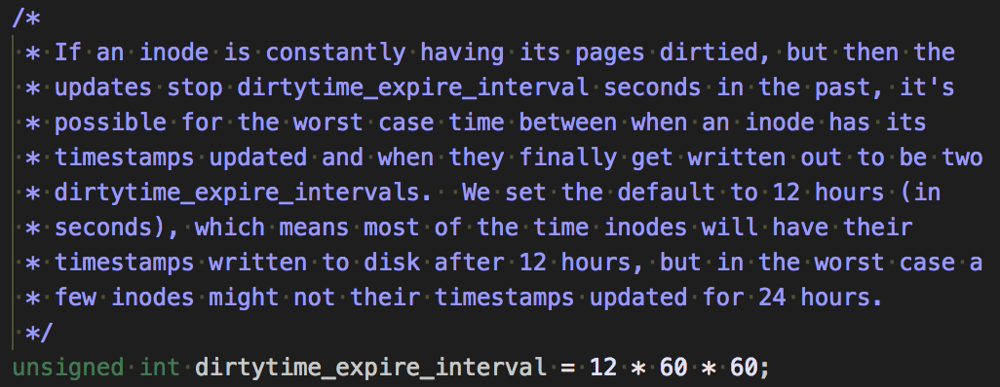

# dirty page가 I/O에 끼치는 영향

`/proc/meminfo`에 `Dirty`라고 표시된 부분



## dirty page란?

리눅스에서 file read를 수행할 때 `page cache`를 이용하여 메모리에 file 내용을 올려서 빠르게 읽을 수 있도록 한다. 근데 `page cache`에 올라온 부분에 쓰기 작업을 해야 된다면?

`page cache`에 덮어쓴 후에 해당 페이지에 `dirty bit`를 설정하여 디스크 상의 내용과 `page cache`의 내용이 다른 것을 표시하고 `dirty page`라고 부름.

### page writeback

이렇게 생성된 `dirty page`는 결국 디스크에 다시 써져야만 하는데, 이렇게 디스크에 다시 써지는 것을 `page writeback`이라고도 한다.

Kernel 버전마다 다르지만, 보통 `page writeback`을 수행하는 thread 이름에는 **flush**가 들어감. 예: `pdflush`, `flush`, `bdflush`, ...

`page writeback`을 자주 수행하지 않으면 전원 장애 등에 의해 변경된 파일 내용 복구가 어려워지게 된다. 반대로 너무 자주 수행한다면 쓰기 I/O 작업이 많아져서 성능 저하를 유발할 수 있음.

따라서 kernel은 `page writeback`을 위한 여러 조건을 설정해서 이 조건들에 따라 작업을 수행함. 다양한 특성을 가진 시스템들에 알맞게 튜닝할 수 있도록 제공되는 kernel parameter들이 있다.

## dirty page 관련 kernel parameters


책에는 파라미터 개수가 6개라고 했는데 Ubuntu 16.04 kernel 버전 4.4.0 기준으로 7개임을 확인함. (책은 3.10.0 버전으로 추정)

### vm.dirty_background_ratio

`dirty page`의 총 메모리 사이즈에 대한 비율이 얼마 이상이 되면 `page writeback`을 수행할지 결정하는 파라미터. **background**라는 단어가 들어간 것에 주목해보면 `page writeback`을 백그라운드로 수행하는 것과 관련이 있다는 것을 쉽게 눈치 챌 수 있음.

### vm.dirty_background_bytes

전체 메모리에 대한 비율이 아닌 절대적 byte 수를 사용한다는 것을 빼면 `vm.dirty_background_ratio`와 비슷한 의미를 가졌다.

### vm.dirty_ratio

`vm.dirty_background_ratio`와 비슷하며 차이점은 이 파라미터에 의해 수행되는 `page writeback`은 백그라운드로 수행되지 않고, I/O를 block한 상태에서 디스크에 `dirty page`들을 다 쭉 내려 쓴다.

### vm.dirty_bytes

`vm.dirty_ratio`와 비슷하며, 전체 메모리에 대한 비율이 아닌 byte 수를 사용함.

### vm.dirty_writeback_centisecs

`flush` 쓰레드를 몇 초 간격으로 깨울 것인지 결정하는 파라미터. Centiseconds이므로 위 스크린샷처럼 500으로 설정하면 5초라는 의미가 되며, 5초에 한 번 `flush`가 깨어나서 **expire된** `dirty page`들의 동기화를 진행함.

`dirty page`가 언제 expire되는지는 `vm.dirty_expire_centisecs`를 통해 조절할 수 있음.

### vm.dirty_expire_centisecs

`vm.dirty_writeback_centisecs` 파라미터 설정에 의해 `flush`가 동기화 작업을 할 때 오래된 `dirty page`들을 골라서 동기화를 하는데, 그 오래되었다는 것의 기준을 조절할 수 있게 해주는 파라미터임. 위 스크린샷처럼 3000으로 설정하면 30초 이상 지난 `dirty page`는 오래된 더티 페이지가 된다.

### vm.dirtytime_expire_seconds

  
linux-4.4.y 브랜치 kernel/sysctl.c 중


  
linux-4.4.y 브랜치 fs/fs-writeback.c 중

inode timestamps와 관계 있는 건 알겠는데 `dirtytime`이 정확히 뭔지 모르겠다. 찾아봐도 친절한 설명이 없음...

---

커널 파라미터들은 서로 완전히 독립적이지 않으며, 어떤 파라미터는 다른 파라미터의 값이 어떻게 설정됐느냐에 따라서 커널이 무시하기도 하고, 알아서 값을 재조절해서 사용하는 경우가 있을 수 있음. 이런 경우에는 어떤 경우들이 있는지 조금 이따가 알아볼 것임.

## 백그라운드 동기화와 주기적 동기화

교재에 따르면 `dirty page` 동기화에는 세 가지 종류가 있다.
1. 백그라운드 동기화
2. 주기적 동기화
3. 명시적 동기화

책에서는 백그라운드 동기화 & 주기적 동기화에 대해 설명함.

### 백그라운드 동기화

교재에 의하면 백그라운드 동기화는 `vm.dirty_background_ratio`, `vm.dirty_ratio`를 통해 조절할 수 있는 작업이라고 한다. `vm.dirty_ratio`의 이름에는 background라는 단어가 없지만 어쨌든 명시적 동기화와 구분되므로 백그라운드 동기화로 볼 수 있다고 책이 그랬다.

### 주기적 동기화

주기적 동기화는 동기화 작업을 주기적으로 수행하는 것을 말함. `vm.dirty_writeback_centisec`, `vm.dirty_expire_centisecs`를 통해 조절할 수 있다. 오래된 `dirty page`를 동기화하는 `flush` 데몬을 얼마나 자주 깨울 것인지와, 얼마나 오래된 `dirty page`를 동기화시킬 건지를 조절함.

### 명시적 동기화

명시적 동기화는 `sync`, `fsync` 등의 시스템 콜을 통해 수행되는 동기화를 말함.

### 백그라운드 동기화 광련 커널 코드 조금 (버전 4.4.y)
`void balance_dirty_pages_ratelimited()`: `dirty page`의 총 크기를 계산하여 동기화 진행 여부를 결정하는 함수는 `balance_dirty_pages()`인데, 오버헤드가 꽤 되기 때문에, 일정 크기 이상의 `dirty page`가 새로 쌓였을 때만 호출되도록 조절(rate limiting) 해주는 함수임.
```c
void balance_dirty_pages_ratelimited(struct address_space *mapping)
{
	struct inode *inode = mapping->host;
	struct backing_dev_info *bdi = inode_to_bdi(inode);
	struct bdi_writeback *wb = NULL;
	int ratelimit;
	int *p;

	if (!bdi_cap_account_dirty(bdi))
		return;

	if (inode_cgwb_enabled(inode))
		wb = wb_get_create_current(bdi, GFP_KERNEL);
	if (!wb)
		wb = &bdi->wb;

	ratelimit = current->nr_dirtied_pause;
	if (wb->dirty_exceeded)
		ratelimit = min(ratelimit, 32 >> (PAGE_SHIFT - 10));

	preempt_disable();
	/*
	 * This prevents one CPU to accumulate too many dirtied pages without
	 * calling into balance_dirty_pages(), which can happen when there are
	 * 1000+ tasks, all of them start dirtying pages at exactly the same
	 * time, hence all honoured too large initial task->nr_dirtied_pause.
	 */
	p =  this_cpu_ptr(&bdp_ratelimits);
	if (unlikely(current->nr_dirtied >= ratelimit))
		*p = 0;
	else if (unlikely(*p >= ratelimit_pages)) {
		*p = 0;
		ratelimit = 0;
	}
	/*
	 * Pick up the dirtied pages by the exited tasks. This avoids lots of
	 * short-lived tasks (eg. gcc invocations in a kernel build) escaping
	 * the dirty throttling and livelock other long-run dirtiers.
	 */
	p = this_cpu_ptr(&dirty_throttle_leaks);
	if (*p > 0 && current->nr_dirtied < ratelimit) {
		unsigned long nr_pages_dirtied;
		nr_pages_dirtied = min(*p, ratelimit - current->nr_dirtied);
		*p -= nr_pages_dirtied;
		current->nr_dirtied += nr_pages_dirtied;
	}
	preempt_enable();

	// 여기서 balance_dirty_pages() 호출
	if (unlikely(current->nr_dirtied >= ratelimit))
		balance_dirty_pages(mapping, wb, current->nr_dirtied);

	wb_put(wb);
}
```

```c
/*
 * balance_dirty_pages() must be called by processes which are generating dirty
 * data.  It looks at the number of dirty pages in the machine and will force
 * the caller to wait once crossing the (background_thresh + dirty_thresh) / 2.
 * If we're over `background_thresh' then the writeback threads are woken to
 * perform some writeout.
 */
static void balance_dirty_pages(struct address_space *mapping,
				struct bdi_writeback *wb,
				unsigned long pages_dirtied)
{
	...
	for (;;) {
		...
		// vm.dirty_background_ratio, vm.dirty_ratio 파라미터 값을 이용해서
		// 동기화를 진행해야 되는 dirty page 수를
		// Global Dirty Throttle Control 구조체에 담는다.
		domain_dirty_limits(gdtc);

		...

		// dirty_freerun_ceiling(thresh, bg_thresh) 는 (bg_thresh + thresh) / 2
		// 를 리턴함. 백그라운드 동기화를 할지 blocking 동기화를 할지 분기하는 부분으로
		// 여기서 break하면 백그라운드로 동기화를 하고 안 하면 프로세스 멈춤이 일어남.
		if (dirty <= dirty_freerun_ceiling(thresh, bg_thresh) &&
		    (!mdtc ||
		     m_dirty <= dirty_freerun_ceiling(m_thresh, m_bg_thresh))) {
			unsigned long intv = dirty_poll_interval(dirty, thresh);
			unsigned long m_intv = ULONG_MAX;

			current->dirty_paused_when = now;
			current->nr_dirtied = 0;
			if (mdtc)
				m_intv = dirty_poll_interval(m_dirty, m_thresh);
			current->nr_dirtied_pause = min(intv, m_intv);
			break;
		}

		...

		if (dirty_exceeded && !wb->dirty_exceeded)
			wb->dirty_exceeded = 1;

		...

		trace_balance_dirty_pages(wb,
					  sdtc->thresh,
					  sdtc->bg_thresh,
					  sdtc->dirty,
					  sdtc->wb_thresh,
					  sdtc->wb_dirty,
					  dirty_ratelimit,
					  task_ratelimit,
					  pages_dirtied,
					  period,
					  pause,
					  start_time);
		__set_current_state(TASK_KILLABLE);
		// I/O를 블락하는 부분
		io_schedule_timeout(pause);

		current->dirty_paused_when = now + pause;
		current->nr_dirtied = 0;
		current->nr_dirtied_pause = nr_dirtied_pause;

		...

		if (fatal_signal_pending(current))
			break;
	}

	if (!dirty_exceeded && wb->dirty_exceeded)
		wb->dirty_exceeded = 0;

	if (writeback_in_progress(wb))
		return;

	/*
	 * In laptop mode, we wait until hitting the higher threshold before
	 * starting background writeout, and then write out all the way down
	 * to the lower threshold.  So slow writers cause minimal disk activity.
	 *
	 * In normal mode, we start background writeout at the lower
	 * background_thresh, to keep the amount of dirty memory low.
	 */
	if (laptop_mode)
		return;

	// 백그라운드 동기화 시작 (flush 쓰레드를 깨운다)
	if (nr_reclaimable > gdtc->bg_thresh)
		wb_start_background_writeback(wb);
}
```

```c
static void domain_dirty_limits(struct dirty_throttle_control *dtc)
{
	const unsigned long available_memory = dtc->avail;
	struct dirty_throttle_control *gdtc = mdtc_gdtc(dtc);
	unsigned long bytes = vm_dirty_bytes;
	unsigned long bg_bytes = dirty_background_bytes;
	/* convert ratios to per-PAGE_SIZE for higher precision */
	unsigned long ratio = (vm_dirty_ratio * PAGE_SIZE) / 100;
	unsigned long bg_ratio = (dirty_background_ratio * PAGE_SIZE) / 100;
	unsigned long thresh;
	unsigned long bg_thresh;
	struct task_struct *tsk;

	/* gdtc is !NULL iff @dtc is for memcg domain */
	if (gdtc) {
		unsigned long global_avail = gdtc->avail;

		/*
		 * The byte settings can't be applied directly to memcg
		 * domains.  Convert them to ratios by scaling against
		 * globally available memory.  As the ratios are in
		 * per-PAGE_SIZE, they can be obtained by dividing bytes by
		 * number of pages.
		 */
		// vm.dirty_bytes가 설정되어 있으면 vm.dirty_ratio를 덮어쓴다.
		if (bytes)
			ratio = min(DIV_ROUND_UP(bytes, global_avail),
				    PAGE_SIZE);
		// vm.dirty_background_bytes가 설정되어 있으면
		// vm.dirty_background_ratio를 덮어쓴다.
		if (bg_bytes)
			bg_ratio = min(DIV_ROUND_UP(bg_bytes, global_avail),
				       PAGE_SIZE);
		bytes = bg_bytes = 0;
	}

	// vm.dirty_bytes가 설정되어 있으면 threshold 계산에 우선적으로 적용
	if (bytes)
		thresh = DIV_ROUND_UP(bytes, PAGE_SIZE);
	else
		thresh = (ratio * available_memory) / PAGE_SIZE;

	// vm.dirty_background_bytes가 설정되어 있으면 bg threshold 계산에 우선적으로 적용
	if (bg_bytes)
		bg_thresh = DIV_ROUND_UP(bg_bytes, PAGE_SIZE);
	else
		bg_thresh = (bg_ratio * available_memory) / PAGE_SIZE;

	// vm.dirty_background_ratio를 vm.dirty_ratio보다 크게 설정하면
	// vm.dirty_ratio의 절반으로 조정된다.
	if (bg_thresh >= thresh)
		bg_thresh = thresh / 2;
	tsk = current;
	if (tsk->flags & PF_LESS_THROTTLE || rt_task(tsk)) {
		bg_thresh += bg_thresh / 4;
		thresh += thresh / 4;
	}
	dtc->thresh = thresh;
	dtc->bg_thresh = bg_thresh;

	/* we should eventually report the domain in the TP */
	if (!gdtc)
		trace_global_dirty_state(bg_thresh, thresh);
}
```

### 주기적 동기화 관련 커널 코드 조금

`flush` 쓰레드가 깨어나서 wb_workfn()를 호출한다.
```c
void wb_workfn(struct work_struct *work)
{
	struct bdi_writeback *wb = container_of(to_delayed_work(work),
						struct bdi_writeback, dwork);
	long pages_written;

	set_worker_desc("flush-%s", dev_name(wb->bdi->dev));
	current->flags |= PF_SWAPWRITE;

	if (likely(!current_is_workqueue_rescuer() ||
		   !test_bit(WB_registered, &wb->state))) {
		/*
		 * The normal path.  Keep writing back @wb until its
		 * work_list is empty.  Note that this path is also taken
		 * if @wb is shutting down even when we're running off the
		 * rescuer as work_list needs to be drained.
		 */
		do {
			// wb_do_writeback()을 통해 실제 동기화 진행
			pages_written = wb_do_writeback(wb);
			trace_writeback_pages_written(pages_written);
		} while (!list_empty(&wb->work_list));
	} else {
		/*
		 * bdi_wq can't get enough workers and we're running off
		 * the emergency worker.  Don't hog it.  Hopefully, 1024 is
		 * enough for efficient IO.
		 */
		pages_written = writeback_inodes_wb(wb, 1024,
						    WB_REASON_FORKER_THREAD);
		trace_writeback_pages_written(pages_written);
	}

	if (!list_empty(&wb->work_list))
		wb_wakeup(wb);
	// wb_wakeup_delayed() 안에서는 vm.dirty_writeback_centisecs값을 이용해서 writeback을 delayed task로 등록함. 
	// vm.dirty_writeback_centisecs 값이 0이면 여기서 delayed task로 다시 등록되지 않는 것.
	else if (wb_has_dirty_io(wb) && dirty_writeback_interval)
		wb_wakeup_delayed(wb);

	current->flags &= ~PF_SWAPWRITE;
}
```

## dirty page 설정과 I/O 패턴

Dirty 관련 kernel parameters 설정은 `flush` 쓰레드를 얼마나 자주 깨울 것인지 + 깨울 때 어느 정도 사이즈를 동기화할 것인지를 설정하는 것이 포인트다. `flush`를 너무 자주 깨우면 I/O 사용량을 적게 유지할 수 있지만 context switching 오버헤드 + CPU 코어를 뺏겨서 발생하는 성능 저하가 생기고, 너무 가끔 깨우면 I/O 사용량이 높이 치솟을 수 있음.

다음과 같은 예를 생각해 보자.

A 시스템: 초당 `10 MB`의 쓰기 작업을 버틸 수 있음  
B 시스템: 초당 `100MB`의 쓰기 작업을 버틸 수 있음.

1. 한 번에 `100MB`의 `dirty page`를 동기화하는 전략을 취할 때  
A 시스템에서는: 동기화 속도가 `dirty page` 생성 속도를 따라잡지 못함 -> 성능 저하  
B 시스템에서는: 적당

2. 한 번에 `10MB`의 `dirty page`를 동기화하는 전략을 취할 때  
A 시스템에서는: 적당  
B 시스템에서는: `flush`가 자주 깨어나기 때문에 쓸데없는 오버헤드 발생


